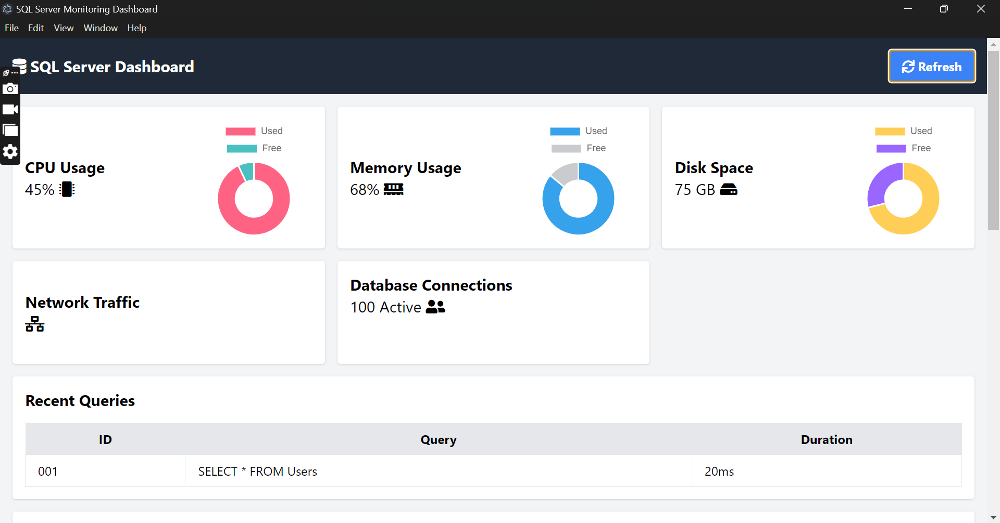

# SQLHealthCheck

SQLHealthCheck is a comprehensive monitoring dashboard designed to provide real-time insights into the health and performance of Microsoft SQL Server environments. It enables database administrators and developers to track critical metrics such as CPU usage, memory utilization, disk space, and active queries, facilitating efficient management and troubleshooting.

## Snaps of Project UI

Take a visual journey through the SQLHealthCheck dashboard with snapshots showcasing its user-friendly interface:



Explore the seamless monitoring experience offered by SQLHealthCheck, empowering you to keep your SQL Server environment in check effortlessly.


## Features

- **Real-Time Monitoring:** Continuously track server performance metrics including CPU, memory, and disk usage.
- **Error Logging:** Capture and display server error logs to aid in quick diagnosis and resolution of issues.
- **Query Performance:** Monitor the performance and duration of SQL queries to identify potential bottlenecks.
- **Historical Data Analysis:** View performance trends over time to assess long-term server health.
- **Responsive Design:** Access the dashboard through any device, ensuring you can monitor your server anytime, anywhere.

## Installation

To set up SQLHealthCheck on your local machine, follow these steps:

```bash
# Clone the repository
git clone https://github.com/NoManNayeem/SQLHealthCheck.git

# Navigate to the project directory
cd SQLHealthCheck

# Install dependencies (specify if there are any)
npm install

# Start the application
npm start
```


# Usage
Once installed, you can access the SQLHealthCheck dashboard by navigating to `http://localhost:3000` in your web browser. Ensure your SQL Server is accessible and that the necessary configuration settings are correct in your environment.


# Contributing
Contributions are welcome! If you have a suggestion that would make this better, please fork the repo and create a pull request. You can also simply open an issue with the tag "enhancement".
Don't forget to give the project a star! Thanks again!

Fork the Project
- Create your Feature Branch (git checkout -b feature/AmazingFeature)
- Commit your Changes (git commit -m 'Add some AmazingFeature')
- Push to the Branch (git push origin feature/AmazingFeature)
- Open a Pull Request


# Contact
Project Link: `https://github.com/NoManNayeem/SQLHealthCheck`